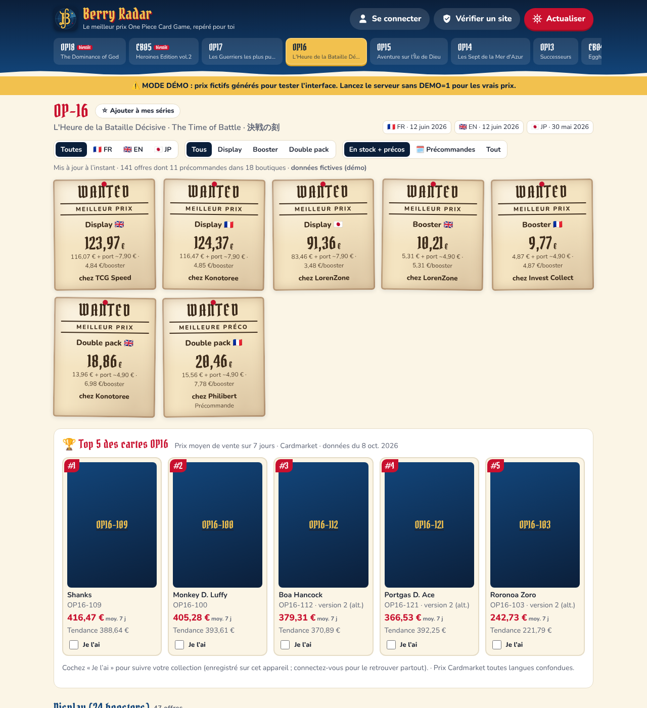

# 📡 Berry Radar — comparateur One Piece Card Game

Application web (installable sur téléphone) qui compare en direct les prix des **displays, boosters, double packs, starter decks et coffrets** One Piece Card Game, série par série, parmi une **liste blanche de boutiques vérifiées**, avec un **score de confiance** pour chaque boutique et une **alerte sur les prix suspects**.

- Séries suivies : OP-13 à OP-18 (OP-18 et EB-05 à venir), EB-03, EB-04, PRB-02, plus un onglet *Starters & coffrets*.
- Langues : 🇫🇷 FR, 🇬🇧 EN, 🇯🇵 JP (détectées dans le titre du produit).
- **Précommandes** : pour une série (ou une langue) pas encore sortie, les offres commandables sont signalées 🗓️ *Précommande* avec la date de sortie. Elles sont aussi détectées partout via la mention « précommande / pre-order » ou le statut « sur commande ». Un filtre *En stock + précos / Précommandes / Tout* permet de les isoler. Une version FR sans date annoncée prend la date EN, car les sorties FR et EN sont simultanées depuis OP-15.
- Total = prix + **port estimé** vers la France, tri par total (et par prix au booster pour les boosters).
- Bouton **Actualiser** : relance la recherche à tout moment. Les résultats sont gardés 10 min côté serveur, et une nouvelle recherche est possible toutes les 45 s par série.



## Lecture des boutiques et diagnostic

Chaque plateforme a plusieurs méthodes de lecture, essayées dans l'ordre. La première qui fonctionne est mémorisée pour la boutique.

| Plateforme | Méthodes |
|---|---|
| Shopify | API de recherche `/search/suggest.json`, puis page de recherche + fiches `/products/…js` |
| WooCommerce | API Store `/wp-json/wc/store/v1/products`, puis page de recherche `?s=…&post_type=product` (utile quand un plugin de sécurité ferme l'API : erreur 401/403) |
| PrestaShop | recherche JSON `ajax=1`, puis page de recherche HTML ou données JSON-LD |
| Détection automatique | toutes les méthodes ci-dessus, puis les données structurées (JSON-LD) de la page de recherche |

Chaque série est cherchée par son code (`OP16`, `OP-16`) et par le nom du set (« Time of Battle », « Bataille Décisive »), car beaucoup de boutiques titrent leurs produits sans le code.

Le bouton **🔍 Diagnostic** de chaque boutique, dans « Boutiques interrogées », interroge la boutique en direct. Il affiche les requêtes envoyées et leur code de réponse, les protections anti-robots reconnues (Cloudflare, Sucuri, DataDome, Wordfence, API WordPress fermée), puis chaque produit lu avec la raison pour laquelle il est retenu ou écarté. **📋 Copier le rapport** permet de transmettre le résultat. Une boutique protégée par un système anti-robots n'est pas contournée : il faut alors passer par le lien direct vers le site.

## Mes boutiques (ajout manuel)

Le bouton **➕ Ajouter une boutique** accepte n'importe quelle adresse. L'app :
1. vérifie la fiabilité du site (même score que pour les boutiques suivies), refuse les sites de la liste noire et avertit si le score est faible ;
2. détecte la plateforme, par son API ou par l'empreinte de sa page d'accueil. Si aucune n'est reconnue, la boutique passe en **détection automatique**. Elle apparaît dans « Boutiques interrogées » avec le tag « ⭐ Ajoutée par vous », et ses offres ressortent dans les résultats avec le tag « ⭐ Ma boutique ».

La liste est enregistrée **dans le navigateur** (10 boutiques maximum) et envoyée au serveur à chaque recherche. Elle fonctionne donc aussi sur Render, qui n'a pas de disque permanent, mais elle est propre à chaque appareil.

## Top 5 des cartes de chaque série (Cardmarket)

Pour chaque série, l'app affiche les 5 cartes les plus chères avec leur visuel, leur **prix de vente moyen sur 7 jours** et leur tendance. Les données viennent des fichiers publics que Cardmarket recalcule chaque nuit (catalogue des cartes et *price guide*). Le serveur les télécharge directement et les garde 12 h en mémoire. Aucun compte ni clé n'est nécessaire.

- Les prix sont toutes langues confondues, comme le *price guide* de Cardmarket.
- Les visuels viennent du site officiel du jeu, d'après le code de la carte. Si l'image d'une version alternative est introuvable, l'app affiche l'image de base, puis le code de la carte.
- La case **« Je l'ai »** est enregistrée sur l'appareil et affiche la valeur estimée de vos cartes du top.
- L'identifiant du jeu One Piece chez Cardmarket (18 par défaut) est détecté automatiquement. On peut aussi le forcer avec la variable d'environnement `CARDMARKET_GAME_ID`.

## Comptes (connexion Google)

Le bouton **Se connecter** permet de créer un compte avec Google. Une fois connecté, l'utilisateur :
- marque ses **séries préférées** (☆ à côté du nom de la série). Elles s'affichent en premier dans les onglets, et l'app s'ouvre sur la première ;
- marque ses **boutiques préférées** (☆ à côté du nom d'une boutique) et peut filtrer avec « ★ Mes boutiques préférées », y compris pour les affiches « meilleur prix » ;
- retrouve sur tous ses appareils ses boutiques ajoutées et ses cartes cochées « Je l'ai ».

Depuis « Mon compte », il voit et retire ses favoris, se déconnecte, ou **supprime ses données**. Sans compte, l'app fonctionne comme avant.

La connexion utilise **Firebase** (Google), gratuit à ce volume. Les préférences sont stockées dans Firestore, dans un document `users/{uid}` que seul son propriétaire peut lire et modifier (règles dans `firestore.rules`).

### Configuration (une seule fois, environ 10 min)

1. Sur [console.firebase.google.com](https://console.firebase.google.com), **créer un projet**. Google Analytics n'est pas nécessaire.
2. Ouvrir **Authentication → Commencer → Sign-in method → Google** et l'activer, avec votre e-mail comme adresse d'assistance.
3. Ouvrir **Firestore Database → Créer une base de données**, en mode production. Choisir une région européenne, par exemple `eur3`.
4. Dans **Firestore → Règles**, remplacer le contenu par celui du fichier `firestore.rules`, puis cliquer sur **Publier**.
5. Dans **Paramètres du projet (⚙️) → Vos applications**, cliquer sur l'icône Web `</>`, enregistrer l'application, puis noter `apiKey`, `authDomain`, `projectId` et `appId`.
6. Donner ces valeurs au serveur :
   - **Render** : onglet *Environment*, ajouter `FIREBASE_API_KEY`, `FIREBASE_AUTH_DOMAIN`, `FIREBASE_PROJECT_ID`, `FIREBASE_APP_ID`.
   - **En local** :
     ```bash
     FIREBASE_API_KEY=… FIREBASE_AUTH_DOMAIN=….firebaseapp.com FIREBASE_PROJECT_ID=… FIREBASE_APP_ID=… npm start
     ```
7. Dans **Authentication → Paramètres → Domaines autorisés**, ajouter l'adresse du site, par exemple `mon-app.onrender.com`. `localhost` est autorisé par défaut.

### Connexion dans l'app installée (écran d'accueil)

Dans l'app installée, la connexion se fait par redirection vers Google. Les navigateurs récents (Safari, Chrome) bloquent alors le stockage du domaine `….firebaseapp.com`, et l'on revient dans l'app sans être connecté. Le serveur relaie donc les pages de connexion Firebase (`/__/auth/…`) sur le domaine du site, pour que tout se passe sur la même adresse. Pour l'activer :

1. Sur Render, remplacer la valeur de `FIREBASE_AUTH_DOMAIN` par l'adresse du site, **sans** `https://` (par exemple `mon-app.onrender.com`), puis enregistrer.
2. Sur [console.cloud.google.com](https://console.cloud.google.com), sélectionner le même projet, puis ouvrir **API et services → Identifiants**. Dans **ID clients OAuth 2.0**, ouvrir *Web client (auto created by Google Service)*. Dans **URI de redirection autorisés**, ajouter `https://mon-app.onrender.com/__/auth/handler`, puis **Enregistrer**. La prise en compte peut prendre quelques minutes.
3. Vérifier que `mon-app.onrender.com` figure dans *Firebase → Authentication → Paramètres → Domaines autorisés*.

Ces valeurs identifient le projet Firebase mais ne sont pas des secrets : la sécurité repose sur les règles Firestore. Sans cette configuration, le bouton « Se connecter » explique que la connexion n'est pas encore activée. En mode démo (`npm run demo`), la connexion est simulée.

## Alertes de prix et historique

Sous chaque affiche **WANTED** :
- **🔔 Alerte** : l'utilisateur connecté choisit le produit, la langue (ou toutes) et un **prix maximum port compris**. Dès qu'une boutique suivie propose ce produit en stock ou en précommande sous ce prix, il reçoit une **notification push** sur ses appareils. Une même offre au même prix n'est notifiée qu'une fois par 24 h. « Mon compte → Mes alertes » permet de mettre en pause, supprimer, voir les appareils abonnés et envoyer une notification de test.
- **📈 Historique** : courbe du meilleur prix en stock (port compris, hors prix suspects) sur 30 j, 90 j ou depuis le début, avec le plus bas, le plus haut et l'évolution. Survoler ou toucher la courbe affiche le prix, la boutique et la date.

Le serveur relève les prix de toutes les séries **toutes les 6 heures**, appelé par un service de cron externe, puisque la formule gratuite de Render met le serveur en veille. Chaque relevé enregistre un point d'historique par produit (document `history/{série}` dans Firestore) puis vérifie les alertes. Les consultations normales ajoutent aussi des points, au plus un par heure. Au-delà de 14 jours, le plus bas prix de chaque tranche de 6 h est gardé. Au-delà de 60 jours, c'est le plus bas prix du jour, sur un an au maximum.

Sur iPhone/iPad, les notifications ne fonctionnent que si l'app est **ajoutée à l'écran d'accueil** (iOS 16.4 ou plus récent) puis ouverte depuis son icône.

### Configuration (en plus des comptes Google ci-dessus)

1. **Règles Firestore** : recopier le nouveau contenu de `firestore.rules` dans *Firestore → Règles*, puis **Publier**. Elles autorisent les champs `alerts` et `pushSubscriptions` et la lecture de `history`.
2. **Clé de compte de service**, pour que le serveur écrive l'historique et lise les alertes sans que l'app soit ouverte :
   - *Paramètres du projet (⚙️) → Comptes de service → Générer une nouvelle clé privée*. Un fichier JSON est téléchargé. Il est **secret** : ne le mettez jamais dans le dépôt.
   - Sur Render, ajouter la variable `FIREBASE_SERVICE_ACCOUNT` et y coller **tout le contenu** du fichier JSON (ou ce contenu encodé en base64).
3. **Clés de notification (VAPID)** : lancer `npx web-push generate-vapid-keys` sur n'importe quel ordinateur avec Node (ou `npm run vapid` dans ce dossier), puis ajouter sur Render :
   - `VAPID_PUBLIC_KEY` : la *Public Key* ;
   - `VAPID_PRIVATE_KEY` : la *Private Key*, qui est secrète ;
   - `VAPID_SUBJECT` : `mailto:votre@email.fr`.

   Ne changez plus ces clés ensuite : les appareils déjà abonnés devraient se réabonner.
4. **Secret du relevé programmé** : ajouter `CRON_SECRET`, une longue chaîne aléatoire (par exemple le résultat de `openssl rand -hex 24`).
5. **Relevé toutes les 6 h** avec [cron-job.org](https://cron-job.org), gratuit :
   - créer un compte, puis *Create cronjob* ;
   - URL : `https://VOTRE-APP.onrender.com/api/cron/collect?key=VOTRE_CRON_SECRET` ;
   - planification *Custom* : minutes `0,5`, heures `*/6` (toutes les 6 h, à h00 et h05). Le premier appel réveille le serveur, le second lance le relevé si le premier est arrivé trop tôt. Les appels rapprochés ne lancent qu'un seul relevé.

   La réponse `202 relevé lancé` (ou `200 relevé récent`) confirme que tout va bien. Le relevé dure quelques minutes en arrière-plan.

Sans `FIREBASE_SERVICE_ACCOUNT`, les boutons 🔔 et 📈 sont masqués. Sans clés VAPID, seul l'historique est actif. En mode démo, l'historique est fictif et les notifications sont simulées.

## Lancer en local

Node.js 20 ou plus récent. **Aucune dépendance à installer.**

```bash
cd onepiece-tcg
npm start          # http://localhost:3000
npm run demo       # mode démo : prix FICTIFS, pour tester l'interface hors ligne
npm test           # tests unitaires
```

## Mettre en ligne gratuitement (Render)

1. Sur [render.com](https://render.com), choisir **New → Web Service** et connecter ce dépôt GitHub.
2. Remplir les champs suivants :
   - **Branch** : la branche contenant l'app.
   - **Root Directory** : `onepiece-tcg`
   - **Runtime** : Node
   - **Build Command** : `npm install` (une seule dépendance, `web-push`, pour les notifications)
   - **Start Command** : `npm start`
   - **Instance type** : Free
3. Une fois déployé, ouvrir l'URL `https://….onrender.com` sur le téléphone, puis :
   - Android/Chrome : menu ⋮ → *Installer l'application*.
   - iPhone/Safari : bouton Partager → *Sur l'écran d'accueil*.

> La formule gratuite de Render met le serveur en veille après 15 min d'inactivité. La première ouverture prend alors environ 30 à 50 s, ensuite c'est instantané.

Toute autre plateforme Node fonctionne aussi (Railway, Fly.io, un VPS, un Raspberry Pi…), car le serveur écoute sur `PORT`.

## Comment ça marche

```
public/            interface (HTML/CSS/JS sans build, PWA)
server/index.js    serveur HTTP + API
server/adapters/   lecture des boutiques : shopify | woocommerce | prestashop
server/classify.js reconnaissance série / type de produit / langue, exclusions
server/prices.js   agrégation, port estimé, alertes de prix, cache
server/trust.js    score de confiance + outil « Vérifier un site »
server/config/     series.json, shops.json (liste blanche), blacklist.json
```

**Lecture des prix** : l'app n'utilise pas Google. Elle interroge directement le moteur de recherche de chaque boutique de la liste blanche, via les points d'accès publics standard :

| Plateforme | Point d'accès |
|---|---|
| Shopify | `/search/suggest.json` |
| WooCommerce | `/wp-json/wc/store/v1/products` |
| PrestaShop | page de recherche en JSON (`ajax=1`), avec repli sur le HTML |

Les sites protégés contre les robots (Cardmarket, Fnac, Cultura, Micromania, Play-In, Amazon) apparaissent sous forme de **liens de recherche directs**.

**Score de confiance (0 à 100)** :

| Critère | Points |
|---|---|
| Boutique sur la liste blanche | +30 |
| Connexion HTTPS | +10 / −20 |
| Mentions légales ou CGV | +10 / −15 |
| SIRET, RCS ou n° de TVA trouvé | +10 |
| Ancienneté du domaine (RDAP) : plus de 5 ans → moins de 6 mois | +20 → −30 |
| Note Trustpilot : 4,5 et plus → moins de 3 | +20 → −20 |
| Magasin physique, enseigne reconnue, référencement Pokescam, protection acheteur | bonus |

Paliers : Très fiable (75 et plus), Fiable (55 et plus), Prudence (35 et plus), Risqué. Si aucune vérification en direct n'aboutit, la boutique affiche « Non vérifiable » au lieu d'un score trompeur.

**Prix suspect** : un prix est signalé s'il est inférieur de 40 % ou plus au prix médian du même produit (même type, même langue), ou s'il passe sous un prix plancher réaliste (par exemple 85 € pour un display FR/EN). Les offres suspectes ne sont jamais mises en avant comme « meilleur prix ».

**Vérifier un site** : collez n'importe quelle adresse pour obtenir son score (liste noire, ancienneté, avis, HTTPS, mentions légales).

## Personnaliser

- **Ajouter une boutique** : ajouter une entrée dans `server/config/shops.json` avec `platform` = `shopify`, `woocommerce`, `prestashop` ou `link`. Pour connaître la plateforme d'un site, la forme de ses URL aide : `/products/…` pour Shopify, `/produit/…` ou `/product/…` pour WooCommerce, `/123-nom-produit.html` pour PrestaShop.
- **Frais de port réels** : ajouter par exemple `"shipping": { "small": 3.5, "large": 8.9, "freeFrom": 100 }` à une boutique. Sans ce champ, les estimations par défaut s'appliquent (France : 4,90 € / 7,90 € ; Europe : 9,90 € / 14,90 €).
- **Nouvelle série** (OP-19…) : ajouter un bloc dans `server/config/series.json` avec ses codes de recherche et ses noms.

## Limites connues

- Les prix proviennent des moteurs de recherche des boutiques. Un titre de produit mal rédigé (langue absente, par exemple) peut être classé en « Langue ? ».
- Une boutique peut changer de plateforme ou bloquer les requêtes automatiques. Elle apparaît alors « injoignable » dans *Boutiques interrogées* et les autres continuent de fonctionner.
- Le port affiché est une estimation. Le score de confiance est une aide à la décision, pas une garantie : payez toujours par CB ou PayPal.

*Outil personnel non affilié à Bandai, Toei Animation ni aux boutiques citées.*
